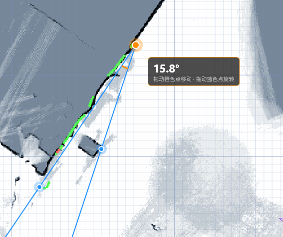
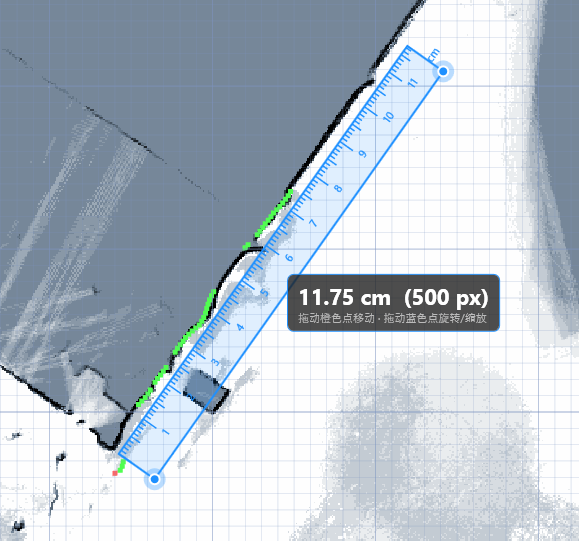

# 屏幕量角器 & 屏幕直尺 (Screen Protractor & Ruler)

一个 WPF 桌面应用，提供透明的屏幕浮层量角器和直尺工具，支持全屏任意位置的角度和长度测量。




## 功能

### 量角器

- 两根可拖动的测量射线，从中心顶点出发
- 实时显示两线夹角（精确到 0.1°），橙色圆弧指示角度范围
- 拖拽橙色中心点移动，拖拽蓝色端点旋转对应测量线

### 直尺

- 从端点 A 到端点 B 的刻度尺，自动检测 DPI 显示厘米刻度
- 毫米短刻度、5 毫米中刻度、厘米长刻度带数字
- 拖拽直尺本体移动，拖拽蓝色端点旋转或缩放

## 使用方法

```bash
Protractor.exe
```

启动后屏幕中央出现透明浮层，默认点击穿透，不干扰下方操作。光标靠近控制点或直尺时自动允许拖动。

### 右键菜单

| 功能            | 说明             |
| --------------- | ---------------- |
| 切换直尺/量角器 | 在两种工具间切换 |
| 重置位置        | 移回屏幕中央     |
| 隐藏            | 隐藏工具浮窗     |
| 退出            | 关闭应用         |

托盘图标双击可显示/隐藏浮窗。

## 编译

需要 Visual Studio 2022 或 .NET 6.0 SDK，Windows 10 / 11。

```bash
dotnet build Protractor.csproj -c Debug
```

## 许可证

MIT License

Copyright (c) 2026 Screen Protractor
